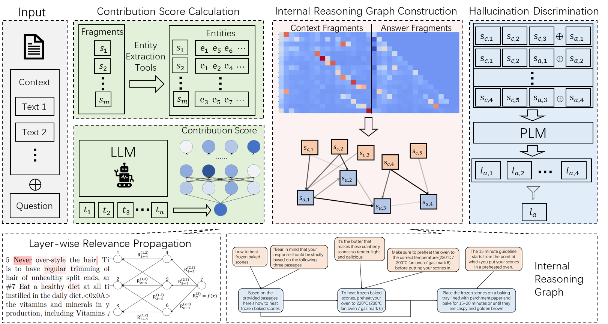

# Detecting Hallucinations in Retrieval-Augmented Generation via Semantic-level Internal Reasoning Graph

## Introduction
This paper proposes a method to construct semantic-level internal reasoning graph of LLMs and uses it for faithfulness hallucination detection.
AlignScore-main is a public library accessible via  https://github.com/yuh-zha/AlignScore .
#### Our Approach

## Usage 
1. run `python core/llama_lrp.py` to get LRP results, which will be saved in `lrp_result_llama_7b` (or download baseline_output.zip lrp_result_llama_7b.zip lrp_result_llama_13b.zip from [NJUBox](https://box.nju.edu.cn/d/dfd5422c7ffc440ba875/))
2. run `python core/build_graph/get_entity.py` to get entities in context.
3. run `python core/build_graph/get_score.py` to get contribution score of fragments.
4. run `python core/AlignScore-main/generate_training_data.py` to prompt of fragments for training.
5. run `python core/AlignScore-main/train.pyrun` to post-train AlignScore model.
6. run `python core/AlignScore-main/graph_test.py` to test the model.

## Baselines 
+ SelfCheckGPT: 
  + run `python baseline/self_checkgpt.py`
  + run `python baseline/self_check_result.py`

+ Prompt LlaMA/GPT:
  + run `python baseline/prompt_llama.py` / run `python baseline/prompt_gpt.py`
  + run `python baseline/prompt_llm_result.py` 

+ Finetune:
  + run `python baseline/llm_finetune.py`
